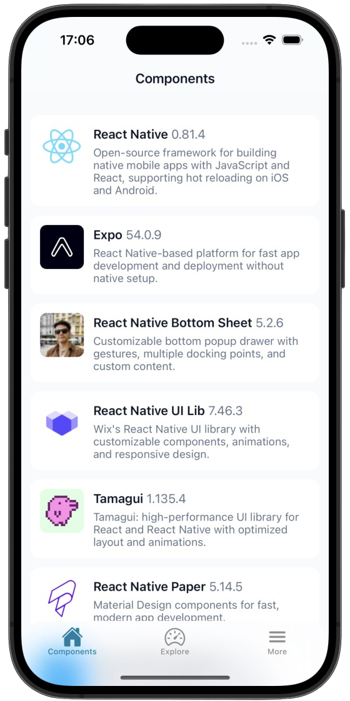
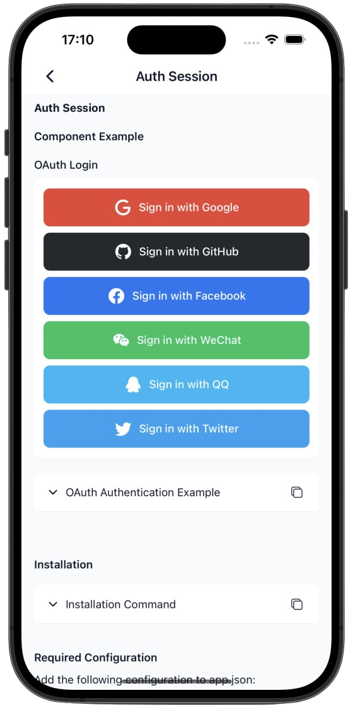
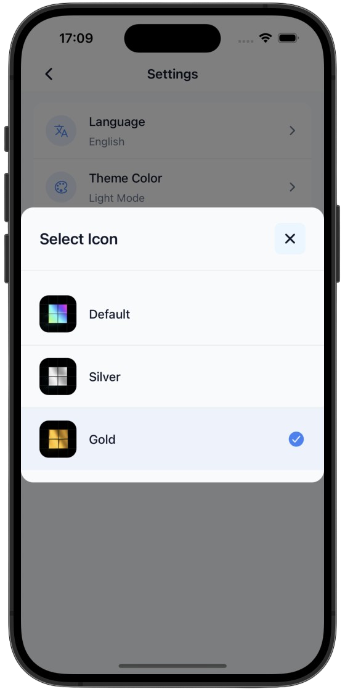

# Expo Docs Web

A modern, multilingual web application built with Next.js 15 and React 19, showcasing Expo documentation and development resources.

## 🌟 Features

- **Modern Tech Stack**: Next.js 15, React 19, TypeScript
- **Multi-language Support**: 11 languages (English, 简体中文, 繁體中文, 日本語, 한국어, Español, Français, Deutsch, Português, Русский, العربية)
- **Rich Animations**: Powered by Framer Motion
- **Backend Integration**: Supabase for database and authentication

## 📥 Download

Get the Expo Docs app on your mobile device:

<div align="center">

[](https://apps.apple.com/us/app/expo-docs/id6739776586?uo=4) [](https://github.com/TF002/expo-docs-web/releases/download/v1.1.0/expodocs_1.1.0.apk)

**🌐 [Visit Official Website](https://www.my1btc.com)**

</div>

<div align="center">
  
  
  
</div>

## 🚀 Quick Start

1. Clone the repository:
```bash
git clone https://github.com/TF002/expo-docs-web.git
cd expo-web
```

2. Install dependencies:
```bash
pnpm install
```

3. Set up environment variables:
```env
NEXT_PUBLIC_SUPABASE_URL=your_supabase_project_url
NEXT_PUBLIC_SUPABASE_ANON_KEY=your_supabase_anon_key
```

4. Run the development server:
```bash
pnpm dev
```

5. Open [http://localhost:3000](http://localhost:3000) in your browser

## 👥 Contact

- **Email**: tsf19982021@gmail.com
- **Telegram**: [@Daniel_tsf002](https://t.me/Daniel_tsf002)
- **GitHub**: [TF002](https://github.com/TF002)
